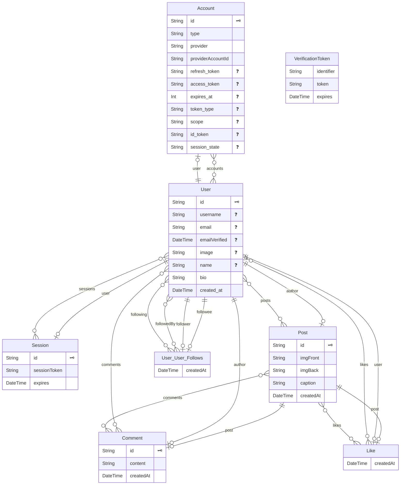

```mermaid
erDiagram

  "Account" {
    String id "🗝️"
    String type 
    String provider 
    String providerAccountId 
    String refresh_token "❓"
    String access_token "❓"
    Int expires_at "❓"
    String token_type "❓"
    String scope "❓"
    String id_token "❓"
    String session_state "❓"
    }
  

  "Session" {
    String id "🗝️"
    String sessionToken 
    DateTime expires 
    }
  

  "VerificationToken" {
    String identifier 
    String token 
    DateTime expires 
    }
  

  "Post" {
    String id "🗝️"
    String imgFront 
    String imgBack 
    String caption 
    DateTime createdAt 
    }
  

  "User" {
    String id "🗝️"
    String username "❓"
    String email "❓"
    DateTime emailVerified "❓"
    String image "❓"
    String name "❓"
    String bio 
    DateTime created_at 
    }
  

  "User_User_Follows" {
    DateTime createdAt 
    }
  

  "Comment" {
    String id "🗝️"
    String content 
    DateTime createdAt 
    }
  

  "Like" {
    DateTime createdAt 
    }
  
    "Account" o|--|| "User" : "user"
    "Session" o|--|| "User" : "user"
    "Post" o|--|| "User" : "author"
    "Post" o{--}o "Comment" : "comments"
    "Post" o{--}o "Like" : "likes"
    "User" o{--}o "Account" : "accounts"
    "User" o{--}o "Session" : "sessions"
    "User" o{--}o "User_User_Follows" : "following"
    "User" o{--}o "User_User_Follows" : "followedBy"
    "User" o{--}o "Post" : "posts"
    "User" o{--}o "Comment" : "comments"
    "User" o{--}o "Like" : "likes"
    "User_User_Follows" o|--|| "User" : "follower"
    "User_User_Follows" o|--|| "User" : "followee"
    "Comment" o|--|| "User" : "author"
    "Comment" o|--|| "Post" : "post"
    "Like" o|--|| "User" : "user"
    "Like" o|--|| "Post" : "post"
```
